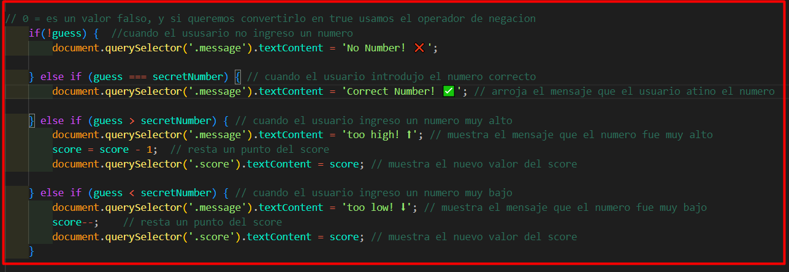

# guess-my-number

**El objetivo del proyecto es simplemente adivinar el numero secreto que sera entre el numero 1 y el numero 20.**


```docment.querySelector('.check').addEventListener('click', function() {
    const guess = Number(document.querySelector('.guess').value);
});
```
- *docment.querySelector('.check')* ---> Esta parte del código encuentra el botón que tiene una clase CSS llamada "_check_".
- *.addEventListener('click', function() { ... })* ---> Una vez que se encuentra ese botón, se le añade algo especial que se llama "_escuchador de eventos_". Esto es como decirle al botón que esté atento a algo. En este caso, le decimos que esté atento al evento de "_click_", es decir, cuando alguien haga clic en el botón.
- *const guess = Number(document.querySelector('.guess').value)* ---> almacena dentro de una variable el numero que el usuario escribio en la caja de texto que tiene la clase CSS '_guess_', usamos la palabra '_Number_' para convertir ese valor de string a number, y el '_.value_' para que me traiga solo el valor escrito en ella.

---


Para generar un numero aleatorio entre el 1 y el 20 y a la vez almacenarlos en una variable:
`let secretNumber = Math.trunc(Math.random() * 20) + 1;`
- Math.trunc()  --> trunca el numero decimal para eliminar los decimales
- Math.random() --> genera un numero aleatorio del 0 al 1.
- * 20  ----> multiplica el resultado para que sea del 1 al 19
- + 1 ------> y le suma 1 para ajustar el rango del 1 al 20, esto se hace para obtener un numero aleatorio entre el 1 al 20, incluyendo ambos extremos.


---


*tenemos 4 escenarios posibles:*
1. cuando el usuario no introduce un numero: 
    - `if(!guess) {...}` <!-- Cuando el input no es un numero, usamos el operador de negacion para convertir este booleano de falso a true -->
2. cuando la suposicion es correcta:
    - `else if (guess === secretNumber) {...}`
3. cuando la suposicion es muy baja:
    - `else if (guess > secretNumber) {...}`
4. cuando la suposicion es muy alta:
    - `else if (guess < secretNumber) {...}`



[!NOTE]
> score = score - 1; (ES EXACTAMENTE IGUAL)  score--;


